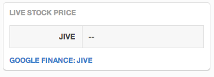

# Introduction to Tiles
Tiles are a new concept introduced that enable you can quickly and easily create powerful integrations with the Jive platform. At a high level, you can think of a tile as having four parts:

1. A Visual style
2. Data
3. An Action
4. A Configuration

### Visual Style
The visual style of a tile is how it is rendered in the Jive user interface. Jive provides a pre-defined set of visual styles that can be used by the developer to render data that is provided from a back end system. Examples include table, list, calendar, and gauge.

### Data
The tile data is the information that is displayed to the user. It is provided to Jive in the form of JSON, and is rendered using a given Visual Style. Here is the definition of the stock-price example. 

	{
	    "sampleData" : {
	        "title" : "Stock Price Example",
	        "contents" : [
	            { "name" : "JIVE", "value" : "--" }
	        ],
	        "action" : {
	            "text" : "Google Finance: JIVE",
	            "url" : "https://www.google.com/finance?q=JIVE"
	        }
	    },
	    "displayName" : "Stock Price (example-stock-tile)",
	    "name" : "example-stock-tile",
	    "description" : "Displays live stock prices",
	    "style" : "TABLE",
	    "icons" : {
	        "16"  : "http://openiconlibrary.sourceforge.net/gallery2/open_icon_library-full/icons/png/16x16/emblems/emblem-money.png",
	        "48"  : "http://openiconlibrary.sourceforge.net/gallery2/open_icon_library-full/icons/png/48x48/emblems/emblem-money.png",
	        "128" : "http://openiconlibrary.sourceforge.net/gallery2/open_icon_library-full/icons/png/128x128/emblems/emblem-money.png"
	    }
	}
	
When this definition is installed into Jive, it will render, by default, the following:

